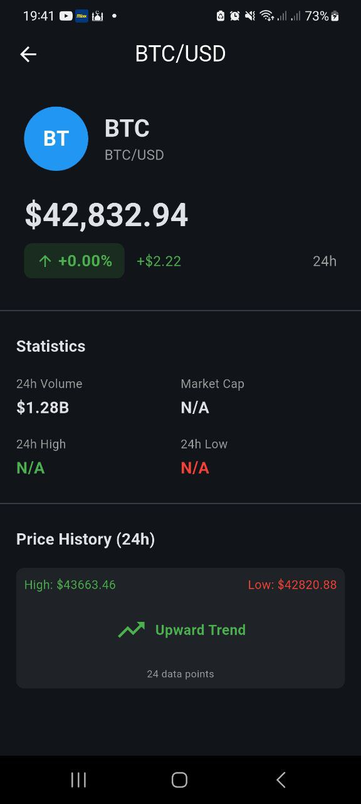
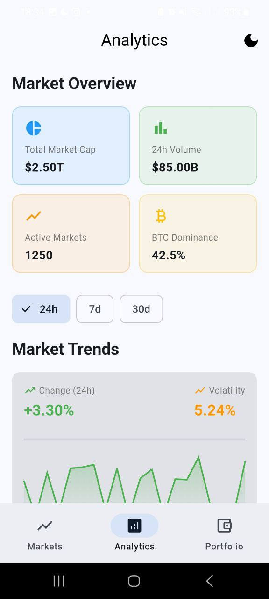
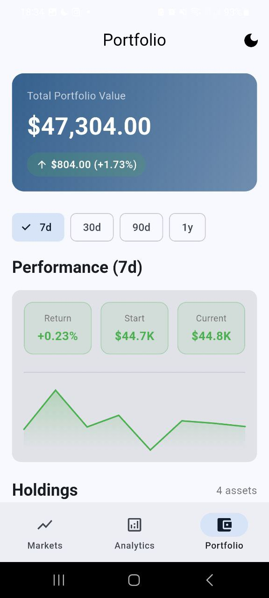
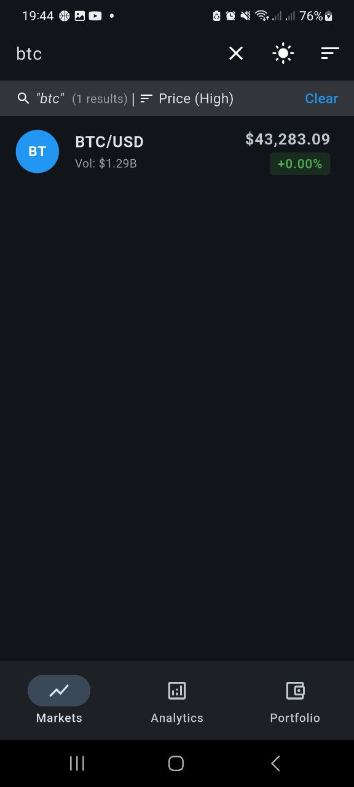
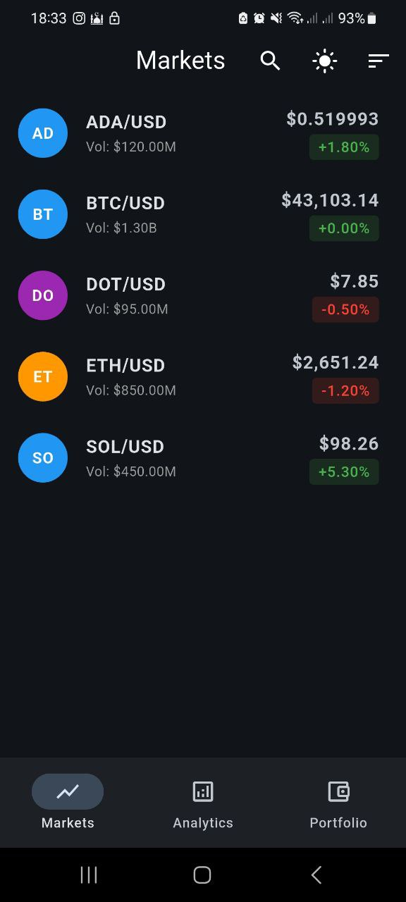
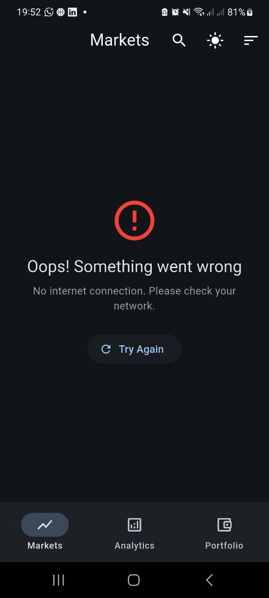

# PulseNow - Crypto Market Trading Mobile App

A Flutter application for tracking crypto markets with real-time data, analytics dashboard, and portfolio management.

## Screenshots

<!-- Add your screenshots here -->

| Markets Screen                      | Market Detail                     | Analytics                               | Portfolio                               |
| ----------------------------------- | --------------------------------- | --------------------------------------- | --------------------------------------- |
|  |  |  |  |

| Search & Filter                   | Dark Mode                          | Loading State                       | Error State                     |
| --------------------------------- | ---------------------------------- | ----------------------------------- | ------------------------------- |
|  |  |  |  |

> **Note:** Create a `screenshots/` folder and add your app screenshots with the names referenced above.

## Features Implemented

### Required Features (100% Completed)

| Requirement      | Status | Description                                                        |
| ---------------- | ------ | ------------------------------------------------------------------ |
| API Integration  | Done   | `ApiService` with complete REST endpoint handling                  |
| Data Model       | Done   | `MarketData` with `fromJson`, `toJson`, `copyWith` and null safety |
| State Management | Done   | Provider pattern with `ChangeNotifier` and `notifyListeners()`     |
| UI Screen        | Done   | `MarketDataScreen` with ListView, loading and error states         |
| Code Quality     | Done   | Clean architecture, null safety, Dart/Flutter best practices       |

### Bonus Features Implemented

| Feature               | Status | Details                                |
| --------------------- | ------ | -------------------------------------- |
| Pull-to-refresh       | Done   | RefreshIndicator on all screens        |
| Currency formatting   | Done   | Formatted prices (e.g., $43,250.50)    |
| Percentage formatting | Done   | With +/- sign and colors (green/red)   |
| Empty state           | Done   | Message when no data available         |
| Retry button          | Done   | On error with explanatory message      |
| Detail navigation     | Done   | `MarketDetailScreen` with data passing |
| Additional fields     | Done   | Volume, market cap, high/low 24h       |
| Search/Filter         | Done   | Real-time search by symbol             |
| Multiple sorting      | Done   | By price, change, volume, symbol       |
| Real-time WebSocket   | Done   | Automatic price updates                |
| Unit tests            | Done   | API, Provider and Model tests          |
| Dark Mode             | Done   | Light/dark theme support               |
| Error handling        | Done   | Custom `ApiException` with HTTP codes  |

## Project Architecture

```
lib/
├── main.dart                 # Entry point, MultiProvider setup
├── models/
│   └── market_data_model.dart    # Immutable data model
├── providers/
│   ├── market_data_provider.dart # Market data state
│   ├── analytics_provider.dart   # Analytics state
│   ├── portfolio_provider.dart   # Portfolio state
│   └── theme_provider.dart       # Theme management
├── screens/
│   ├── home_screen.dart          # Home screen
│   ├── market_data_screen.dart   # Markets list
│   ├── market_detail_screen.dart # Market detail view
│   ├── analytics_screen.dart     # Analytics dashboard
│   └── portfolio_screen.dart     # Portfolio management
├── services/
│   ├── api_service.dart          # REST API client
│   └── websocket_service.dart    # Real-time WebSocket service
├── router/
│   ├── app_router.dart           # Route definitions
│   └── main_shell.dart           # Bottom navigation shell
└── utils/
    └── constants.dart            # App-wide constants
```

## Tech Stack

| Technology         | Version | Purpose                      |
| ------------------ | ------- | ---------------------------- |
| Flutter            | 3.8.1+  | UI Framework                 |
| Dart               | 3.0+    | Language                     |
| Provider           | 6.1.1   | State Management             |
| http               | 1.1.0   | REST Requests                |
| web_socket_channel | 3.0.3   | Real-time WebSocket          |
| intl               | 0.18.1  | Formatting (currency, dates) |

## Installation & Setup

### Prerequisites

- Flutter SDK 3.8.1+
- Node.js 18+ (for backend)
- An emulator or physical device

### Steps

1. **Clone the project**

```bash
git clone <repository-url>
cd pulse-now-int
```

2. **Install Flutter dependencies**

```bash
flutter pub get
```

3. **Start the backend**

```bash
cd backend
npm install
npm start
```

4. **Configure API URL** (if needed)

In `lib/utils/constants.dart`, adjust the IP according to your setup:

```dart
// For Android emulator
static const String baseUrl = 'http://10.0.2.2:3000/api';

// For physical device (replace with your IP)
static const String baseUrl = 'http://192.168.1.102:3000/api';

// For iOS simulator / localhost
static const String baseUrl = 'http://localhost:3000/api';
```

5. **Run the application**

```bash
flutter run
```

## Running Tests

```bash
# All tests
flutter test

# Specific tests
flutter test test/services/api_service_test.dart
flutter test test/providers/market_data_provider_test.dart
flutter test test/models/market_data_model_test.dart
```

## Key Technical Highlights

### 1. WebSocket with Auto-Reconnection

- Exponential backoff reconnection strategy
- Maximum 5 reconnection attempts
- Keep-alive ping every 30 seconds

### 2. App Lifecycle Management

- WebSocket reconnection on app resume
- Proper resource cleanup on dispose

### 3. Provider Pattern

- MultiProvider at root level
- Consumer widgets for UI updates
- Clear separation of concerns

### 4. Robust Error Handling

- Custom `ApiException` class
- HTTP status code specific messages
- Network error detection

## API Endpoints Used

| Method | Endpoint                           | Description             |
| ------ | ---------------------------------- | ----------------------- |
| GET    | `/api/market-data`                 | List all markets        |
| GET    | `/api/market-data/:symbol`         | Get symbol data         |
| GET    | `/api/market-data/:symbol/history` | Get price history       |
| GET    | `/api/analytics/overview`          | Get market overview     |
| GET    | `/api/analytics/trends`            | Get market trends       |
| GET    | `/api/analytics/sentiment`         | Get market sentiment    |
| GET    | `/api/portfolio`                   | Get portfolio summary   |
| GET    | `/api/portfolio/holdings`          | Get holdings list       |
| GET    | `/api/portfolio/performance`       | Get performance metrics |
| WS     | `ws://localhost:3000`              | Real-time updates       |

## Commit History

The project follows Conventional Commits:

```
feat(websocket): implement real-time market updates via WebSocket
feat(screens): add search and sort functionality to HomeScreen
feat(screens): add MarketDetailScreen with navigation
test: add comprehensive unit and widget tests
chore: update Android config and API settings for device testing
```

## Author

Developed as part of the PulseNow Flutter Technical Assessment.
